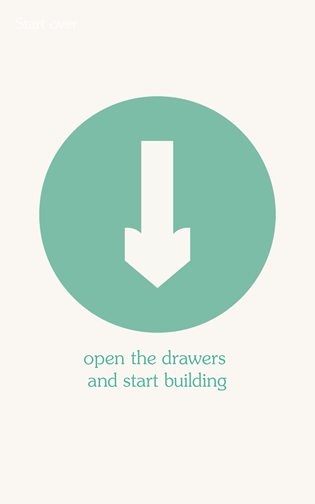
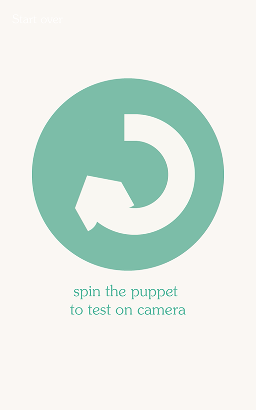
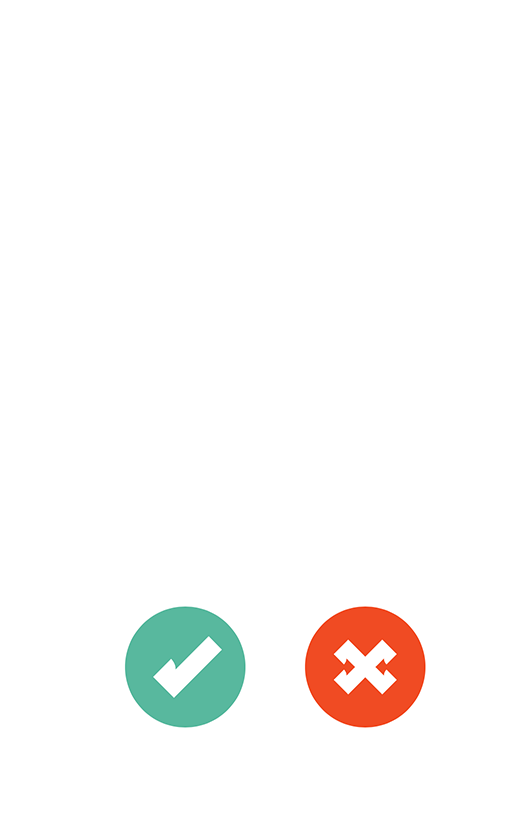

#Anything Muppets

1. [Overview](#overview)
1. [Setting Up](#setting-up)
   1. [Setup Development](#setup-Development)
   1. [Cameras](#cameras)
1. [Running](#running)
1. [Section overview](#section-overview)
1. [Troubleshooting](#troubleshooting)

## Overview

## Overview
A touchpoint where people are given the chance to learn the Henson performance method. The performance is recorded and the user can retrieve it later from the sharing station. 

## Setting Up
The Anything Muppets computer runs on a single computer, which is responsible for:
 * Interfacing with one industrial cameras
 * Hosting webserver for graphic interface
 * Syncing videos to Central Server
 * Connecting to a hardware interface–which appears as a keyboard–to detect when visitor 'spins' Muppet

From a hardware perspective, this involves:
* Mac mini
* Touchscreen: [10" Elo touch](http://www.elotouch.com/Products/LCDs/1093L/)
* One [Point Grey Flea](https://www.ptgrey.com/flea3-32-mp-color-usb3-vision-sony-imx036-camera) cameras, with a [Fujifilm 2.8-8mm zoom lens](https://www.ptgrey.com/fujinon-yv28x28sa-2-hd-vari-focal-lens-3) 
* A USB 3.0 hub
* A directional speaker
* An [Adafruit Feather](https://www.adafruit.com/product/2771) connected via USB, which connects to two (2) buttons

The first time you run this installation, you may have to run "Discover Cameras". See the [Cameras](#cameras) section below.

### Setup Development
* Please see the [Development](Development.md) document for details on setting up a development environment.
 
### Cameras
The Anything Muppets installation uses a [Point Grey Flea](https://www.ptgrey.com/flea3-32-mp-color-usb3-vision-sony-imx036-camera) cameras, with a [Fujifilm 2.8-8mm zoom lens](https://www.ptgrey.com/fujinon-yv28x28sa-2-hd-vari-focal-lens-3)

To configure the cameras, open the [AnythingMuppets](Frontend/bin/AnythingMuppets.app) application

0. Plug in a keyboard

#### App configuration
Tap 'm' to open up the configuration mode. You may have to click/tap on the screen one or more times before it recognizes the keyboard. It should look like this (cropped for ease-of-use):

0. Top right:
   - Refresh - Reload settings (set to defaults)
   - Disk - Save settings
     - The settings files are _inside_ the application: 
       - Right click and select 'Show package contents'
       - Navigate to Contents/Resources
       - 'settings_perf.xml' is the XML file for this GUI
0. Performance or AM - Slider
   - Slide this to '0' to tell the Frontend this is a 'performance' installation
   - Slide to '1' to say it's the Anything Muppets installation
   - (this is mostly used for testing!)
0. Reload cameras - Button
   - Re-connect to cameras. Use this if you've unplugged a camera, or are exeriencing general problems. You shouldn't have to use this often!
0. Discover cameras - Button
   - Find any connected Point Grey Cameras. Do this the first time you plug in your cameras.
   - This will open and _save over_ any existing settings! It will also set the default settings of the camera based on which installation you are running.
   - This saves to 'performance.xml' inside the app (see 'Save' above)
0. Which camera top - Slider
   - Use this to set which camera– 0 or 1–is the 'top' camera. 
0. Recording Params - section
   - This is an advanced section! Only edit this if you absolutely have to
   0. Camera switch interval - slider
      - How often it edits between the two cameras - in milliseconds
      - Default - 3 seconds (3000)
   1. Recording length - slider
      - How long the recordings are at maximum (failsafe)
      - Note: the frontend sends a 'done' event, so this is really based on the length of your movie clips
0. Advanced params - section
These are all read-only, and can be set by editing the settings XML file _inside the application_ (see 'Save' above)
   0. Output folder - text input
   0. Stream which camera - slider
      - Read-only value of what camera is currently showing up in the frontend

#### Camera configuration
Type 'm' again to open up Camera settings

0. Top right - Refresh and save (see above)
   - These save to Contents/Resources/performance_camera.xml
0. Mode - slider
   - This sets how the camera draws to the frontend:
     0. Scale to height
     1. Scale to width
     2. Draw without scaling
1. Camera ____ (where ___ is the camera GUID)
There will be as many of these groups as there are cameras

  - Guid - read-only ID of camera
  - Hi-res/lo-res - slider
    - Read/draw camera at low or high-resolution
    - Low is default; high is unnecessary and will slow down your machine!
  - Bayer cv/off - slider
    - Turn on or off bayer decoding, which interprets color images from the camera
    - If Color/BW is set to 'true', this should be set to '1'
    - If color/bw is set to 'false' - or you want a black and white image - set to '0'
  - Brightness - slider
    - Brightness, gamma, gain, and shutter all adjust camera settings
  - Gamma - slider
  - Gain - Slider
  - Shutter - slider
  - Reset camera - button
    - Similar to 'reset' on the previous screen, resets the USB hub and the camera
    - Do this if you are seeing any visual glitches
    - You may need to do this if/when you switch between Color and Black-and-white
  - Color/BW - toggle
    0. Show a color image - make sure 'Bayer' is set to '0' 
    1. Show a black-and-white image
  - Mirror on/off - toggle
    - Turn horizontal mirroring on or off
  - Aspect x - slider
    - Target aspect ratio of cropped image
    - Set this with Aspect y to crop to a specific ratio, e.g. 16 (x) by 9 (y)
    - Set to 0 to turn off cropping
  - Aspect y - slider
    - Target aspect ratio of cropped image
    - Set this with Aspect y to crop to a specific ratio, e.g. 16 (x) by 9 (y)
    - Set to 0 to turn off cropping

## Running

## Section overview

## Troubleshooting
