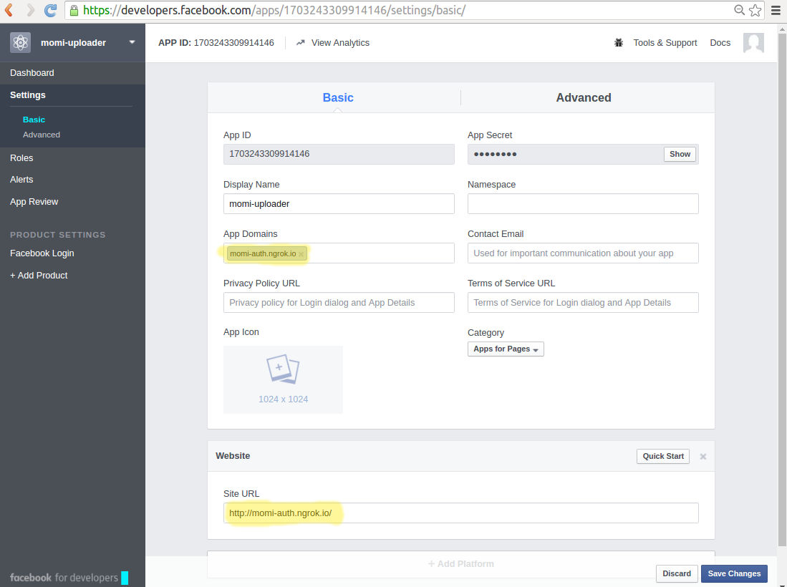
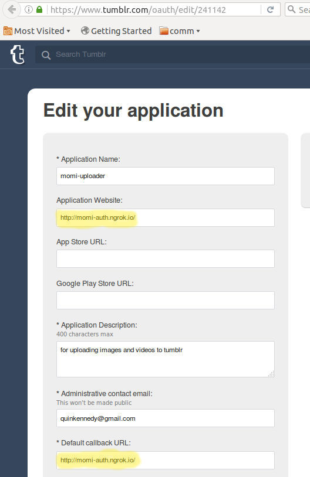

This Node.js® server posts videos and photos to the Museum's Facebook and Tumblr pages.

0. [dependencies](#dependencies)
0. [setup](#setup)
  0. [platform authentication](#platform-authentication)
    1. [facebook](#facebook)
    2. [tumblr](#tumblr)
0. [configuration](#configuration)
  1. [config.json](#configjson)
  2. [facebookToken.json](#facebooktokenjson)
  3. [tumblrToken.json](#tumblrtokenjson)
0. [Running](#running)
  0. [Endpoints](#endpoints)
0. [Troubleshooting](#troubleshooting)

# dependencies
developed/tested/used with

* Node.js
  - 5.9.1 
  - 4.3.1
* npm 
  - 3.7.3
* -nix OS
  - Ubuntu 14.04
  - OSX 10.11
* [Facebook app](https://developers.facebook.com/apps/) setup directions [below](#facebook)
* [Tumblr app](https://www.tumblr.com/oauth/apps) setup directions [below](#tumblr)
* server for serving images and videos to the internet
  - publicly-accessible server
  - [ngrok](../Readme.md#using-ngrok)

# setup
This webservice requires a lot of setup. You need to authenticate against
each network you want to post to, and set up a server to be able to serve
media to the internet.

1. Open Terminal
2. Navigate to where you installed the MMI_Interactives code, and to the Sharing folder inside
  * ```cd /path/to/MMI_Interactives/Sharing```
3. `npm install` to download all Node.js dependencies
4. go through [Platform Authentication](#platform-authentication)

## platform authentication
First we need to set up the ability to post media to Tumblr and Facebook.
These instructions were current as of May 2016.

0. Ensure your server has a publicly-accessible URL
  - The token-fetching server binds to port 8012. Make sure requests are forwarded to the appropriate port before continuing.
  - For the Museum server, this should already be configured. For testing and/or debugging, we suggest using [usig ngrok](https://github.com/wearecollins/MMI_Interactives/#using-ngrok)
  - If your computer or network configuration make this impractical, read through [using ngrok](../Readme.md#using-ngrok)
1. Setup a [config.json](#configjson) file by copying and renaming the config.json.sample file
  - Open this file (you will edit it in the Facebook and Tumblr steps below)
2. Set up a Facebook App ([below](#facebook)) and Tumblr App ([below](#tumblr))
3. Follow the instructions for the [Token Fetching Service](fetchToken/)

### facebook
You will need a [Facebook App](https://developers.facebook.com/apps/) to be
able to post to Facebook. 
* This requires you be signed in as an owner of the MMI Facebook Page

Once you are signed in, you can set up the App.

0. Click 'Create a new app' on the [Facebook App page](https://developers.facebook.com/apps/) 
1. Setup the app, selecting a memorable 'Display Name' and entering your email in 'Contact Email'
2. Once you're setup, click the "Settings" tab
   0. First, click "+ Add Platform"
   1. Select "Website"
   2. In "App Domains" (under settings) and "Site URL" (under 'Website'), enter your public-facing URL
     0. For production, it will most likely be [http://www.movingimage.us/](http://www.movingimage.us/)
     0. For developing using ngrok, it will be something like http://2z999999.ngrok.io
     0.  
   3. Click "Save Changes"
3. You may add other users via the _Roles_ tab
   0. In order to authenticate with the Sharing script, they must have a Role (_Administrator_, _Developer_, or _Tester_)
4. From the "Dashboard" page, show the App Secret (click show)
5. Enter the Facebook App's ID and Secret into [config.json](#configjson)

### tumblr
You will need a [Tumblr app](https://www.tumblr.com/oauth/apps) to be 
able to post to Tumblr. This requires you sign in as the Museum on Tumblr.

0. Navigate to [https://www.tumblr.com/oauth/apps](https://www.tumblr.com/oauth/apps)
1. Click "+ Register Application"
2. On the Setup screen, fill in all required fields:
  - Application Name: 'HensonPost' or similar (up to you)
  - Application Description: "A Tumblr app that posts content from the Jim Henson Exhibition"
  - Website URL: see 'Default callback URL' below; it should match this.
  - Administrative contact email: your email
  - Default callback URL: The URL you setup above
    0. For production, it will most likely be [http://www.movingimage.us/](http://www.movingimage.us/)
    0. For developing using ngrok, it will be something like http://2z999999.ngrok.io
    0. 
3. Click "Register" to finish
4. Copy the Tumblr App's Key and Secret into [config.json](#configjson)
  - This is always accessible under your app at the [Tumblr Apps page](https://www.tumblr.com/oauth/apps)

# configuration

## config.json
configuration settings go in config.json. 
A sample is in [config.json.sample](config.json.sample) with sensitive data removed.

* **processInterval** number of milliseconds between processing the queue of media to post
* **maxAttempts** the number of consecutive upload failures for any particular item before it is removed from the queue.
* **media**
  - **localpath** the relative path from [server.js](server.js) to the directory where the media files are served from
  - **netpath** the web address used to reach the media files
    - e.g. for the Museum server, it may look like this (the slash is necessary):
    - ``` "netpath":"http://www.movingimage.us/" ```
* **facebook**
  - **app** details of the Facebook App being used for posting
    * **id** the App ID
    * **secret** the App Secret
* **tumblr**
  - **app** details of the Tumblr App being used for posting
    * **key** OAuth consumer key
    * **secret** OAuth consumer secret

### notes

For both **media.localpath** and **media.netpath** 
the _filename_ that is supplied to the sync webservice 
is simply concatenated to the end. 
Lets assume **media.localpath** is `"../../media/"` 
and **media.netpath** is `"http://www.movingimage.us/muppets/"`, 
then the filename _performance/video.mp4_ will result in 
_../../media/performance/video.mp4_ 
and _http://www.movingimage.us/muppets/performance/video.mp4_. 
If your server configuration is such that simple concatenation 
is not appropriate, extra development will be necessary.

## facebookToken.json
This file should not be created or edited manually. Use the [fetchToken](fetchToken/) app to create this file.

* **page** details for the page to post media to
  - **token** long-live token for authenticating requests
  - **id** the Facebook ID of the page
* **album** _optional_ details for the album to post photos to
  - **id** the Facebook ID of this album
* **videoList** _optional_ details for the video list to post videos to
  - **id** the Facebook Id of this video list

## tumblrToken.json
This file should not be created or edited manually. Use the [fetchToken](fetchToken/) app to create this file.

* **accessToken** the Tumblr access token to use for authenticating requests
* **accessSecret** the associated token secret for authenticating requests
* **blog** the name of the blog to post to

# Running

start this server with `npm start`.
It will start an HTTP server on port 8013. 
The Sharing server itself does not need to be accessible from the internet, 
but the media files you want to post will need to be.

In production this will probably be set up to start on boot using Upstart 
or init.d in which case you will configure those services to execute 
`/PATH/TO/node /PATH/TO/REPO/Sharing/server.js ./config.json` 
where _/PATH/TO/node_ can be determined by running `which node`.

If the computer you are working from cannot serve files to the internet, 
you can use ngrok and a static server to open a tunnel to the media directory 
(**media.localpath** in _config.json_). 
Follow the instructions in [#setup-ngrok]() 

## endpoints

* **POST /video** In order to upload Videos, 
post the filename (relative to **media.localpath** in _config.json_) 
of the video to `/video` like so: 
`curl --data "filename=performance/myvideo.mov" http://localhost:8013/video`
* **POST /photo** In order to upload Photos, 
post the filename (relative to **media.localpath** in _config.json_) 
of the photo to `/photo` like so: 
`curl --data "filename=anythingmuppets/myphoto.png" http://localhost:8013/photo`
* **GET /state** You can check the status of files like so:
`curl http://localhost:8013/state?filename=anythingmuppets/myphoto.png`
  - This endpoint returns a JSON-formatted response: `{"filename":"FILENAME","type":"TYPE","state":"STATE"}`
    * _FILENAME_ will match the queried filename
    * _TYPE_ will be either `photo` or `video`
    * _STATE_ will be either `unknown`, `posting`, `posted`, or `failed`
      - _unknown_ means the file was never submitted for posting, or it has since been deleted from the server.
      - _failed_ means the file failed to post too many times. It can be re-submitted for posting.

# Troubleshooting

* Make sure the media files are accessible from the internet.
* Make sure the **media.localpath** and **media.netpath** values are correct and resolve POST-ed _filename_ values to the correct relative path and internet address.
* Make sure the Sync service is properly and periodically copying files from the touchpoint computers to the server.
* The Sharing server uses [log4js](https://npmjs.com/package/log4js) 
  - The script will normally log to rolling files in the [log/](log/) directory
  - to enable console logging add `{"type":"console"}` to the **appenders** array in [log4js_conf.json](log4js_conf.json)
  - you can change the logging detail by changing the value of **levels.[all]** (and/or any other key in the **levels** object) in [log4js_conf.json](log4js_conf.json) to `"INFO"`, `"DEBUG"`, `"TRACE"`, or `"ALL"`
